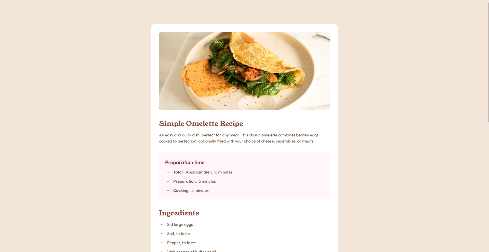

# Frontend Mentor - Recipe page solution

This is a solution to the [Recipe page challenge on Frontend Mentor](https://www.frontendmentor.io/challenges/recipe-page-KiTsR8QQKm). Frontend Mentor challenges help you improve your coding skills by building realistic projects. 

## Table of contents

- [Overview](#overview)
  - [The challenge](#the-challenge)
  - [Screenshot](#screenshot)
  - [Links](#links)
- [My process](#my-process)
  - [Built with](#built-with)
  - [What I learned](#what-i-learned)
  - [Useful resources](#useful-resources)
- [Author](#author)

## Overview

### The challenge

The challenge was to build out the recipe page and get it looking as close as possible to the design provided by Frontend Mentors.

### Screenshot



### Links

- Solution URL: [Frontend Mentors Solution](https://www.frontendmentor.io/solutions/responsive-recipe-page-with-scss-dX3jb3qiSG)
- Live Site URL: [Netlify](https://fm-recipe-page-challenge-sergio.netlify.app/)

## My process

1. Analyze the designs
2. Implement my CSS reset code
3. Add all the root/global values as well as any utility class I might need
  3.1 Create the fluid typography
4. Create the structure in the html files (utilizing the BEM methodology)
5. Add the section/component specific styling

### Built with

- Semantic HTML5 markup
- CSS custom properties
- Flexbox
- Mobile-first workflow
- Scss
- Responsive Design

### What I learned

This challenge was a perfect opportunity to create custom ul and ol markers. Specially with the ol list markers, it was fun to play with the CSS counter functionality, which is a variable I don't usually get to play around with.

```scss
ol {
  counter-reset: list-counter; // Initialize a new counter
    li {
        counter-increment: list-counter; // Increment counter for each item
        &::before {
            content: counter(list-counter) ".";
            font-weight: var(--fw-semibold);
        }
    }
  }
```

### Useful resources

- [Google Fonts](https://fonts.google.com/) - Best website for web fonts.

## Author

- Website - [Sergio Eduardo Castro Ceballos](https://sergiocas.com/)
- Frontend Mentor - [@SergioCasCeb](https://www.frontendmentor.io/profile/SergioCasCeb)
- LInkedIn- [Sergio Eduardo Castro Ceballos](www.linkedin.com/in/sergio-eduardo-castro-ceballos)
